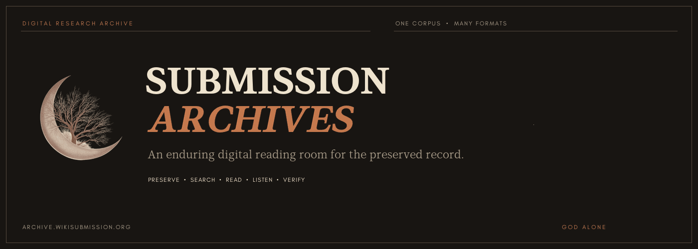

# Submission Archives

Submission Archives is a digital reading room preserving the recorded and written work of Dr. Rashad Khalifa. It brings Qur'an editions, studies, sermons, video programs, books, appendices, and *Submitters Perspectives* into one research-focused archive.

[Visit the archive](https://archive.wikisubmission.org) · [Search the corpus](https://archive.wikisubmission.org/search) · [Read the Qur'an](https://archive.wikisubmission.org/quran) · [Browse written works](https://archive.wikisubmission.org/written) · [Archive Editorials](https://archive.wikisubmission.org/editorials)

## The Archive

- **Qur'an:** A readable 1992 edition with structured chapters, footnotes, subtitles, multilingual material, and preserved 1981 and 1989 editions.
- **Audio:** Qur'an studies, Messenger audios, sermons, and related recordings with synchronized transcripts where available.
- **Video:** Preserved programs and talks connected to their source recordings and searchable passages.
- **Written works:** Books, historical publications, organized appendices, and 64 issues of *Submitters Perspectives* from 1985 through 1990.
- **Archive Editorials:** Technical monographs and research notes exploring how the archive is preserved, transcribed, and indexed.
- **Research search:** Exact phrases and nearby terms lead back to the relevant timestamp, page, verse, or complete source.

The interface is designed as an editorial archive rather than a streaming catalog. Dates, editions, page numbers, source relationships, and transcription status remain visible so visitors can move from discovery to evidence.

## Technology

- [Next.js](https://nextjs.org/) App Router with React 19 and TypeScript
- Tailwind CSS and repository-local typography
- YouTube-backed audio and video playback
- Local PDF readers for books, newsletters, and Qur'an material
- Generated, schema-validated search indices
- Playwright browser coverage and Node test suites
- Standalone Docker deployment with a readiness endpoint

## Repository Layout

The filesystem mirrors the main areas of the site. Browser-requestable artifacts live under `public/`; canonical sources and catalog inputs remain under `data/`.

```text
assets/
  readme/                         # repository presentation assets
data/
  catalog/                        # server-side catalog inputs
  sources/                        # canonical transcripts and source material
public/
  content/
    audios/                       # /audios assets
    quran/
      organized_appendices/
        1981/
        1989/
        1992/                     # appendix editions
    videos/                       # /videos assets
    written/
      books/
      newsletters/               # /written assets
  editorials/                    # visual SVG assets for research monographs
  data/generated_indices/        # browser-readable catalog and search data
src/
  app/                            # Next.js routes (/written, /editorials, /library, etc.)
  components/                     # shared interface, reader, and media components
  content/
    editorials/                   # self-contained MDX editorial monographs
scripts/
  assets/ generate/ process/ validate/
```

## Local Development

Use Node.js 20 or newer (Node.js 22 LTS recommended via `.nvmrc`).

```bash
git clone https://github.com/WikiSubmission/SubmissionArchives.git
cd SubmissionArchives
npm ci
cp .env.example .env.local
npm run dev
```

Open [http://localhost:3000](http://localhost:3000). `SITE_URL` defaults to the production archive and can be overridden in `.env.local`.

---

### Multi-Device Development & Lockfile Synchronization

If you work on this repository across multiple machines (e.g. laptop and desktop PC), follow these rules to avoid `package-lock.json` merge conflicts and unexpected diff churn:

#### 1. Always use `npm ci` after pulling changes
When pulling changes from git on another machine, run `npm ci` rather than `npm install`:

```bash
git pull
npm ci
```

- **`npm ci` (Clean Install)**: Strictly reads `package-lock.json` and installs the exact dependencies recorded in git. It **never modifies** your lockfile.
- **`npm install`**: Re-evaluates dependencies against your local operating system and cache, which can rewrite `package-lock.json` and create unwanted git diffs. Only run `npm install <package>` when you are intentionally adding or updating a library.

#### 2. Cross-Platform Consistency
The repository includes configuration to guarantee parity across Windows, macOS, and Linux:
- **`.gitattributes`**: Enforces LF line endings for `package-lock.json` and all source files to prevent Windows CRLF churn.
- **`.npmrc`**: Configures exact package saving (`save-exact=true`) and preserves optional platform dependencies.
- **`.nvmrc`**: Locks the Node runtime target to `v22`.

#### 3. Universal Docker Environment (Optional)
If you prefer running a 100% identical environment without managing Node versions on the host machine:

```bash
docker compose up
```

This starts the Next.js development server at [http://localhost:3000](http://localhost:3000) inside an isolated Linux container.

---

## Catalog Workflow

Regenerate the public indices after changing catalog inputs, source lists, or public assets:

```bash
npm run generate:catalog
npm run validate:catalog
npm run audit:assets
```

The generator compiles catalog metadata and searchable source material into `public/data/generated_indices/`. The validator checks the runtime contract and confirms that referenced local assets exist.

## Verification

```bash
npm run lint
npm run typecheck
npm test
npm run build
npm run test:e2e
```

For the complete deployment check, run:

```bash
npm run verify:deploy
```

## Deployment

The included multi-stage `Dockerfile` produces the same standalone Next.js artifact used by the self-hosted deployment.

```bash
docker build -t submission-archives .
docker run -p 3000:3000 submission-archives
```

The production container runs as an unprivileged user. `/api/health` reports catalog readiness for Coolify and other container orchestrators.

## Banner

The animated banner is generated from the original Submission logo and repository-local fonts. The optional rebuild step requires Python 3 with [Pillow](https://python-pillow.github.io/):

```bash
python scripts/assets/build_readme_banner.py
```

The script writes `assets/readme/submission-archives-banner.gif` and keeps the motion asset reproducible without altering the source logo.

---

*Dedicated to preserving and sharing the message of God alone.*
