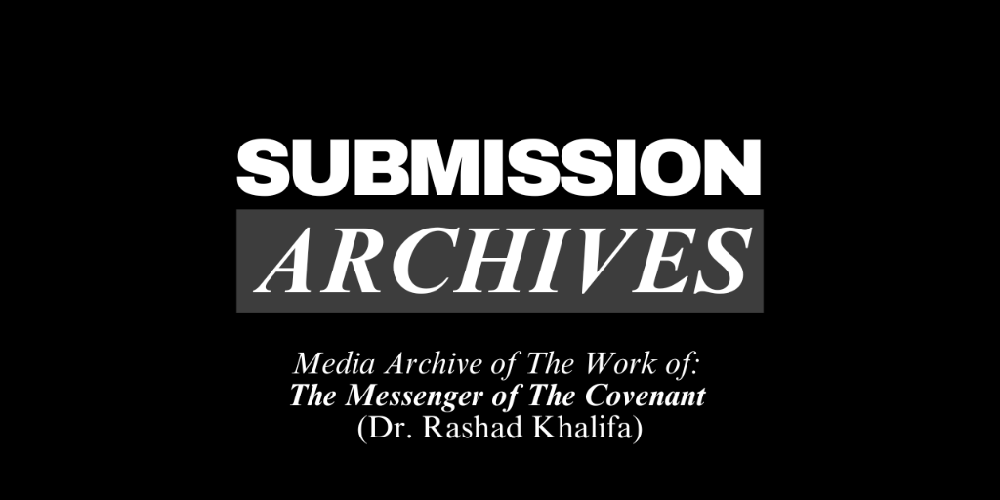

# SubmissionArchives



**SubmissionArchives** is a comprehensive media archive preserving the work of **Dr. Rashad Khalifa**, the Messenger of the Covenant. This platform serves as a digital library for his audio recordings, video programs, and written publications, featuring advanced search capabilities across transcripts and texts.

## Archive Categories

### Audio & Video
- **Quran Studies**: Complete collection of 52 MP3 audio studies conducted by Dr. Khalifa and the masjid.
- **Messenger Audios**: Extensive archive of sermons, discussions, and studies from the 1980s.
- **Video Programs**: Restored MP4 video programs including *King of Chaos*, *Old Message New Messenger*, and other seminal works.
- **Sermons**: A curated compilation of sermons, including the pivotal "God Is Doing Everything."

### Written Works
- **Submitters Perspectives**: Complete newsletter archive from February 1985 to March 1990.
- **Appendices**: In-depth elaborations on Quranic topics, including the *Introduction* and *Proclamation* from Dr. Khalifa's translation.
- **Other Publications**: Various works including books (*Quran, Hadith, Islam*), brochures (e.g., *Contact Prayer/Salat*), and articles.

## Features

- **Deep Search**: Full-text search across all video/audio transcripts and written materials.
- **Smart Filtering**: Filter results by media type, year, or category.
- **Transcript Synchronization**: Read along with audio/video playback.
- **Responsive Design**: Optimized for desktop and mobile devices.

## Roadmap

### Quick Notes (Coming Soon)
A topical aggregation engine designed to compile all mentions of specific subjects across the entire archive.
*   *Example*: A "Contact Prayer (Salat)" note would aggregate every sermon clip, Quran study remark, and newsletter article mentioning Salat details (e.g., the correction on numbering units from Quran Study 52) into a single, organized view.

## Architecture & Technology

Built on a modern stack designed for performance and longevity:

- **Framework**: [Next.js](https://nextjs.org/) (App Router)
- **Language**: [TypeScript](https://www.typescriptlang.org/)
- **Styling**: [Tailwind CSS](https://tailwindcss.com/)
- **Storage**: **Cloudflare R2** (Serves 50GB+ of media)
- **Search**: Custom client-side engine with fuzzy matching and n-gram indices.

## Local Development

### Prerequisites
- Node.js 18+
- NPM

### Setup

1.  **Clone & Install**:
    ```bash
    git clone https://github.com/HadithCritic/SubmissionArchives.git
    cd SubmissionArchives
    npm install
    ```

2.  **Configure Environment**:
    Create a `.env.local` file in the root with your Cloudflare R2 credentials (required for media playback):
    ```env
    R2_ACCOUNT_ID=your_id
    R2_ACCESS_KEY_ID=your_key
    R2_SECRET_ACCESS_KEY=your_secret
    R2_BUCKET_NAME=your_bucket
    ```

3.  **Run Dev Server**:
    ```bash
    npm run dev
    ```
    Open [http://localhost:3000](http://localhost:3000).

4.  **Production Build**:
    ```bash
    npm run build
    ```
    *Note: This automatically runs `build-search-index.ts` to generate optimized search indices.*

## Recent Updates (v2.1)

### Mobile Responsiveness
Major UI overhaul to ensure a seamless experience on mobile devices:
- **Responsive Navigation**: New mobile-friendly header with hamburger menu and slide-out drawer.
- **Adaptive Homepage**: Horizontal scrolling stats bar and single-column media layouts for small screens.
- **Optimized Content**: Typography and layouts (e.g., "The False Verses") now scale gracefully.
- **Improved Player**: Video and transcript views stack vertically on mobile for better usability.

### Codebase Cleanup & Optimization
- **Script Audit**: Removed deprecated debugging scripts to keep the repository clean.
- **Structure**: Reorganized deprecated "Biblical" code and orphaned files.
- **Performance**: Optimized build process and dependency management.

### R2 Storage Migration
- **VTT Transcripts**: Migrated all local transcript files (`.vtt`) to Cloudflare R2.
- **Direct Fetching**: Updated application logic to fetch transcripts directly from R2, reducing repository size and local dependencies.

---

*Dedicated to the preservation and dissemination of the message of God alone.*
